# Projet Android Studio 4A

### RAMIN TOM 4AFI2

## 1) Présentation du Projet

Réalisation d'une application mobile à l'aide de l'IDE "Android Studio". Cette application représente la liste des douzes classes de
l'univers du Krosmoz à travers différentes époques: celle de Wakfu, de Dofus, ou encore de Dofus Retro. Une fois la classe choisie,
vous aurez accès à la description d'un personnage de cette classe à chaque époque grâce aux différents framgents mis en places.

## 2) Fonctionnalités

- Deux activité (MainActivity et DetailActivity contenant les fragments)
- Trois Fragments
- RecyclerView
- Barre de recherche par classe
- Appel WebService à une API Rest 
- API créée et stockée au format JSON sur mon Github dans le projet API_2
- Utilisation de nombreuses images dont un grand nombre stocké dans le dossier "img appli dofus" dans le projet API_2
- Design
- Architecture MVC
- Utilisation de Git
- Lien cliquable dans chaque fragment qui amène à la page de description de la classe en question
- CollapsingToolbar
- Icône de l'application modifiée
- Rotation de l'écran supportée

## 3) Apprentisage

- Renforcement des bases en JAVA et en programmation mobile acquises en 3e année
- Création d'une API
- Création de Fragment
- Utilisation des Fragments

## 4) Screenshots
### Accueil
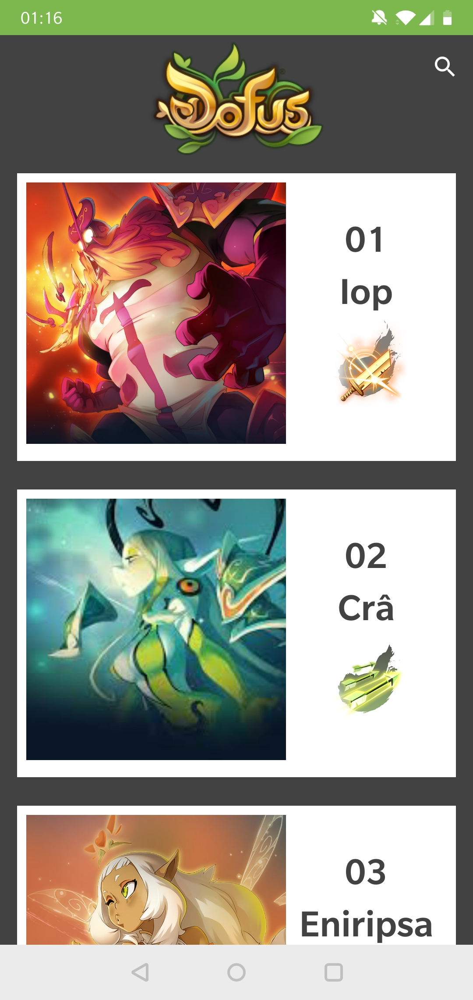 
#### Search
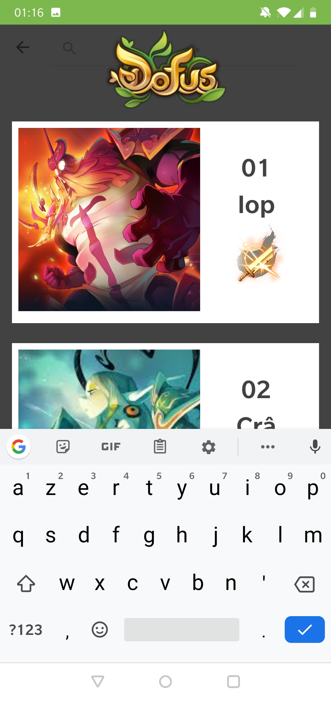  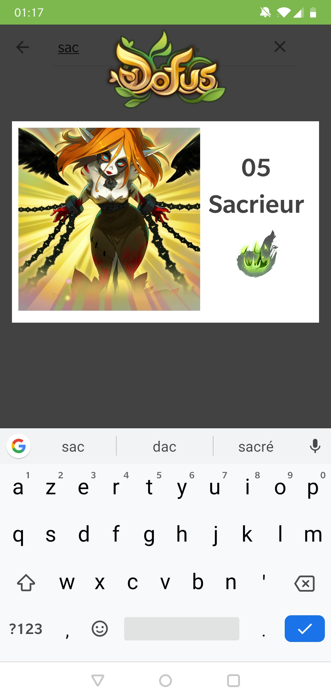   
### Fragments
#### 1) Wakfu
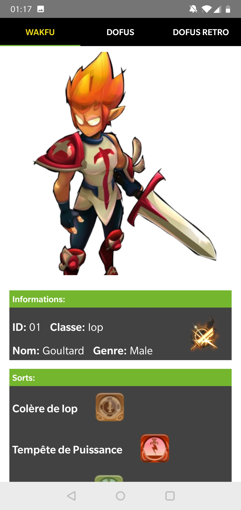  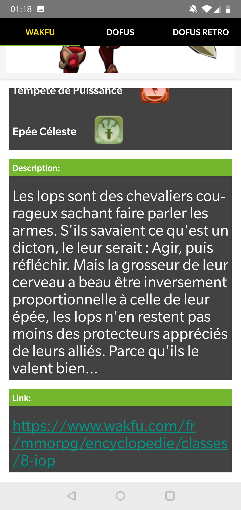   
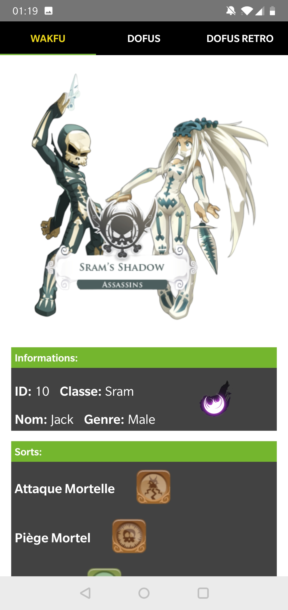  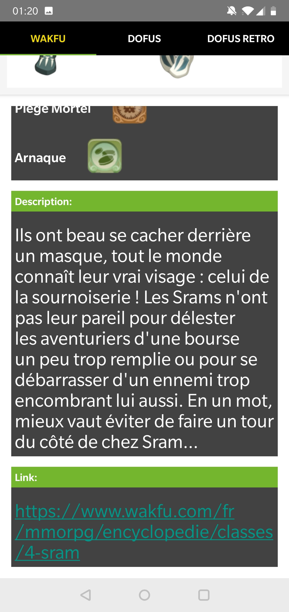   
#### 2) Dofus
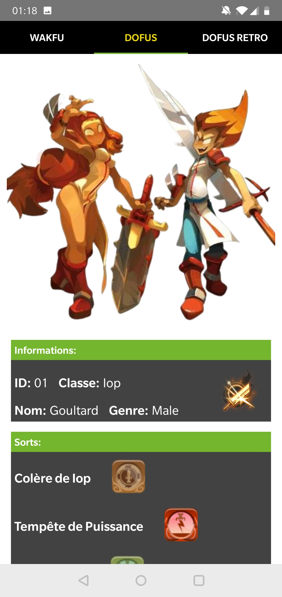  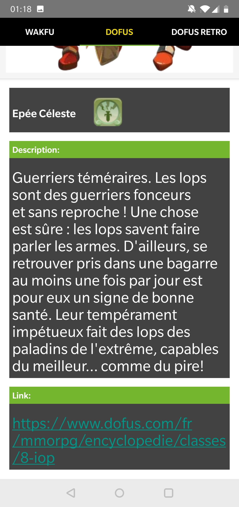   
#### 3) Dofus Retro
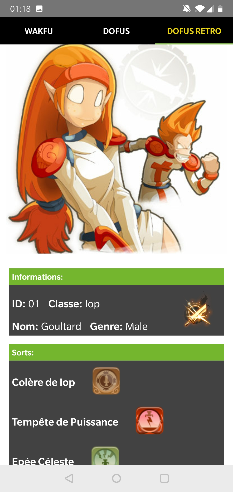  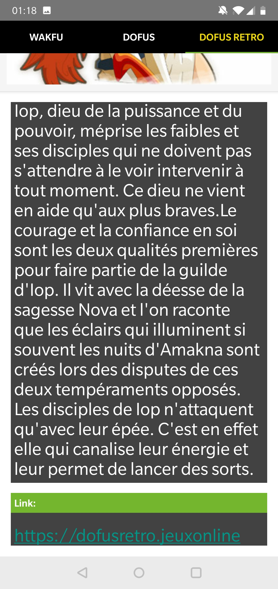   

### Mode Paysage
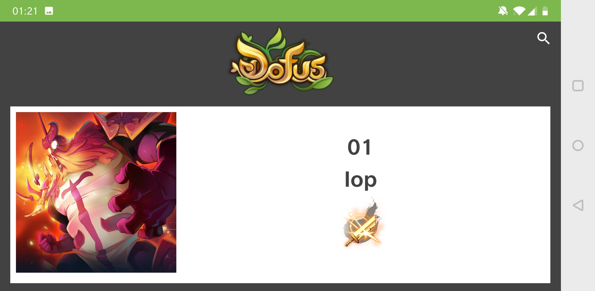  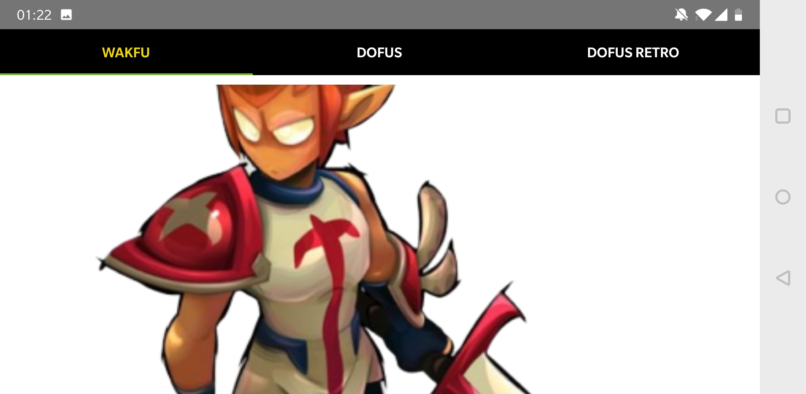  
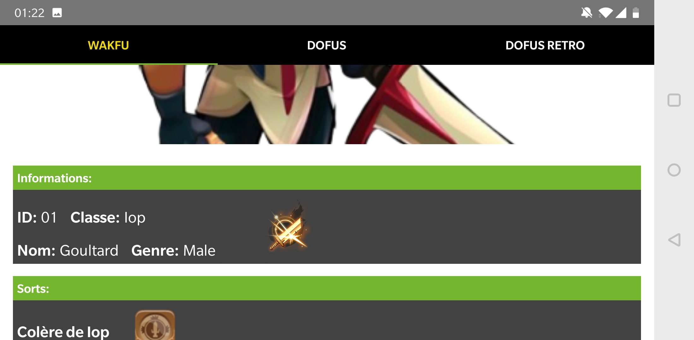     
### Icône

